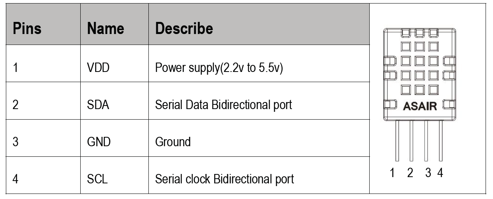
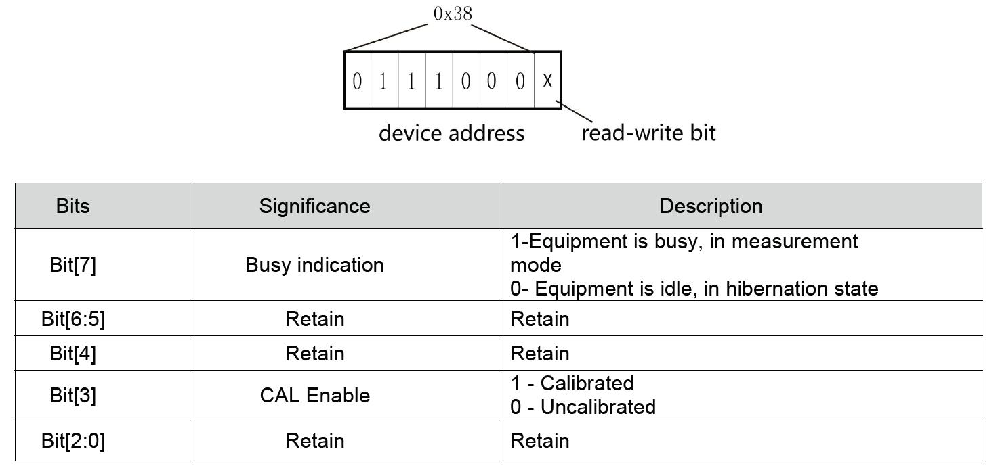
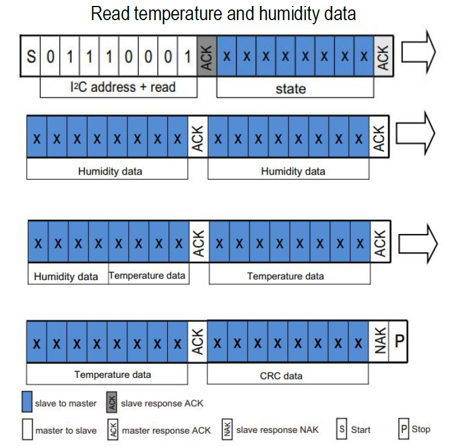
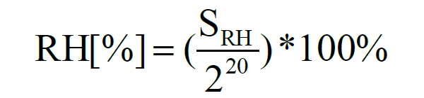
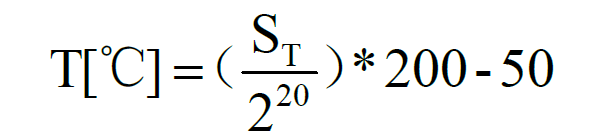

## 引

`ASAIR` 继 [DHT11](http://www.aosong.com/en/products-21.html) 推出了 [DHT20](http://www.aosong.com/en/products-67.html) ，采用 `I2C` 协议通信 ，本文提供简单驱动。

### 引脚定义 & 从机地址




### 数据格式 & 转换

`DHT20` 上电之后需等待 `100ms` 并初始化，测量时的数据格式如图示：



测量后分别将获得温湿度的 20 位数据带入下图公式计算得出测量值。




如数据：`1c（状态字）8c 67 34 e5 2c`，计算得到湿度：54.844951%`RH`，温度：11.190032`℃`.

### 示例代码

```c
int8_t dht20_run(float *pdht20)
{
    uint8_t pt_DAT[] = {0xAC,0x33,0x00};
    uint8_t pr_DAT[7] = {0x00};
    static char init = 1;

    if(init)
    {
        HAL_Delay(100);//上电100ms等待
        init -= 1;
    }
    HAL_I2C_Master_Receive(&hi2c1,0x71,pr_DAT,1,100);//读状态字

    if( (pr_DAT[0] & 0x10) && (pr_DAT[0] &0x08) )
    {
        HAL_Delay(10);
        HAL_I2C_Master_Transmit(&hi2c1,0x71,pt_DAT,3,100);//触发测量
    }
    else
    {
        //dht20_RegInit();//初始化1B\1C\1E寄存器
        //return Reg_status;
    }
    HAL_Delay(80);//等待转换

    HAL_I2C_Master_Receive(&hi2c1,0x71,pr_DAT,7,100);//接受数据
    while( pr_DAT[0]&0x80 )
    {
        //Busy_handler();//正忙
    }

    pdht20[0] = (((pr_DAT[1]<<12) + (pr_DAT[2]<<4) + (pr_DAT[3]>>4))*100.0) / 0xfffff;
    pdht20[1] = ((((pr_DAT[3]<<28)>>12) + (pr_DAT[4]<<8) + (pr_DAT[5]))*200.0) / 0xfffff - 50;
}
```
