## 引

相较于 `Keil` 等开发环境，`EIDE` 的优点在于`VSCode`平台上拼接各种插件满足开发需求。本文讲解基本的 `EIDE` 配置，并协作 `STM32CubeMX` 实现 `STM32` 的开发。

### STM32CubeMX

[STM32CubeMX](https://www.st.com/zh/development-tools/stm32cubemx.html) 是 `ST` 公司开发的一款图形配置工具，可通过配置自动生成初始化代码，在生成的沙箱段中支持用户编写应用程序，支持 `EWARM` 、`MDK-ARM` 、`STM32CubeIDE` 、`Makefile` 等样式的工程输出。

### Visual Studio Code

[Visual Studio Code](https://code.visualstudio.com/download)是微软开发的一款轻量级代码编辑器，支持多种编程语言，具有丰富的插件库。

如果下载安装较慢可以参考[超详细的 VSCode 下载和安装教程](https://blog.csdn.net/leah126/article/details/131661331)中的替换镜像方法。

#### 一些基本的插件

##### C/C++

选中左侧导航栏的 `EXTENSIONS` ，搜索 `C/C++` 点击安装。

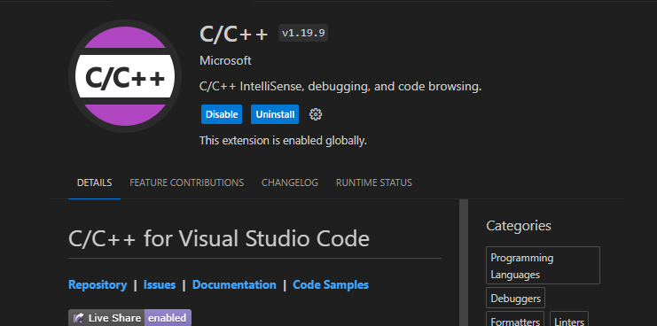

选中左侧导航栏底部的 `Manage` 点击 `Settings` 搜索 `IntelliSense` ，可使能代码补全与配置参数。

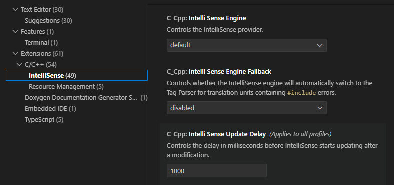

##### Cortex-Debug

在 `EXTENSIONS` 中，搜索 `Cortex-Debug` 点击安装，用来调试` Cortex-M` 内核的 `GDB` 插件。

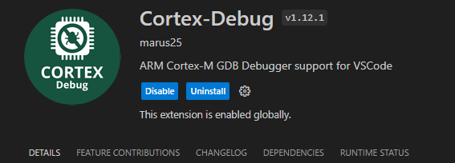

##### Embedded IDE

同样在 `EXTENSIONS` 中安装使用，附：[EIDE 教程](https://em-ide.com/docs/intro) 、[EIDE 论坛](https://discuss.em-ide.com/)。

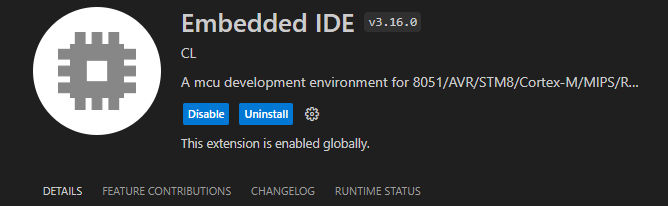

###### 插件与配置

- Setup Utility Tools

在 `EIDE` 中选择左下区域的 `OPERATIONS` ，点击 `Setup Utility Tools`，安装相应的工具。

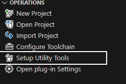

图示是我目前下载的工具，以供参考。

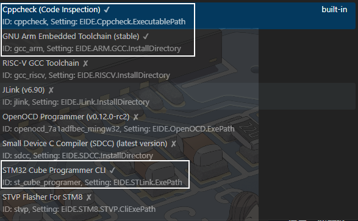

- 绑定编译器

如果想要和 `keil` 项目共生，回到 `Setting` 中，搜索 `ARM` 并在 `ARMCC5` `、ARMCC6` 和 `ARM.INI` 下方地址栏中分别填入编译器及 `MDK-ARM` 的本地路径，使能 `ARMCC` 生成的 `.axf` 文件转成 `.elf` 文件。

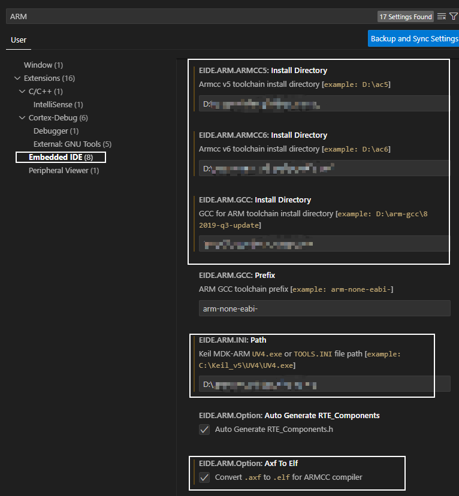

### CubeMX + VSC 开发流程

#### 创建 Makefile

`Makefile` 文件定义了一系列规则，指明了源文件的编译顺序、依赖关系等，用来自动化编译 `C/C++` 项目。上文述及， `STM32CubeMX` 可以生成 `Makefile` 文件，无需开发者编写。

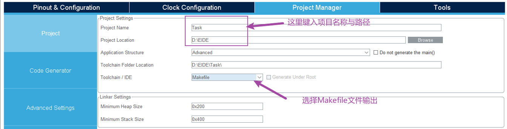

#### 新建 EIDE 工程

选中左侧导航栏的 `EIDE` ，点击`创建新工程->空项目`。

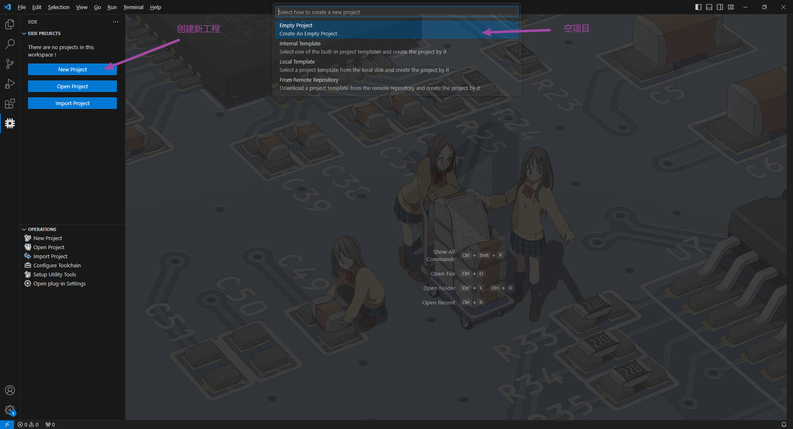

笔者选用的芯片是 _STM32F407_ 系列的，故选择 `Cortex-M Project`。

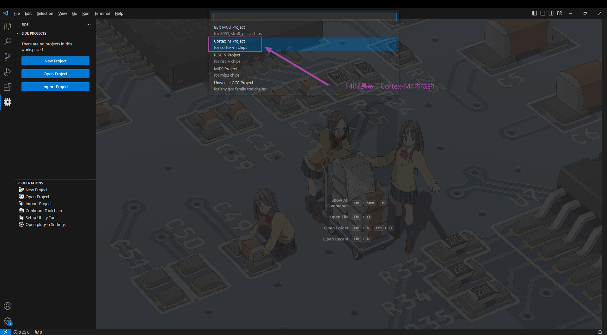

需要仔细的是，此时的 `EIDE` 的新建工程名称应与前在 `STM32CubeMX` 设置的工程名称一致。

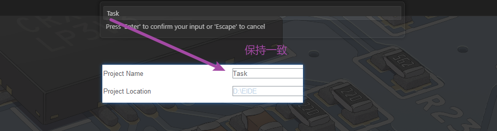

项目路径同样需要保持一致。

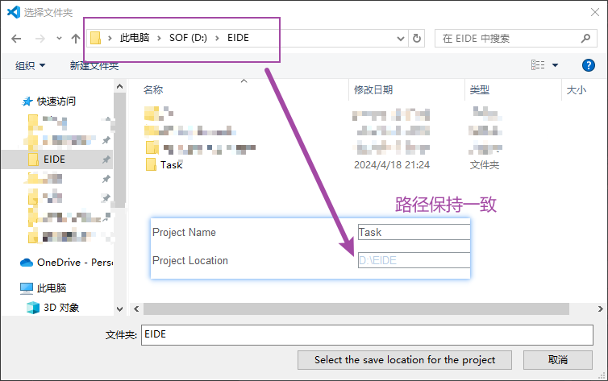

因为之前通过 `STM32CubeMX` 创建了项目文件，这里 `EIDE` 会提示是否基于已有的路径创建工程文件。

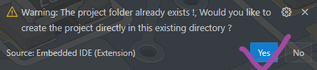

切换工作区。

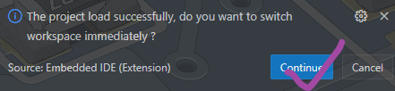

#### 添加 Core 与 Drivers

在生成的 `EIDE` 工程界面中点击 `Project Resources` ，选择 `Normal Folder` ，导入 `Core` 与 `Drivers` 文件夹。~~只导入文件也是可以的，但是不建议~~

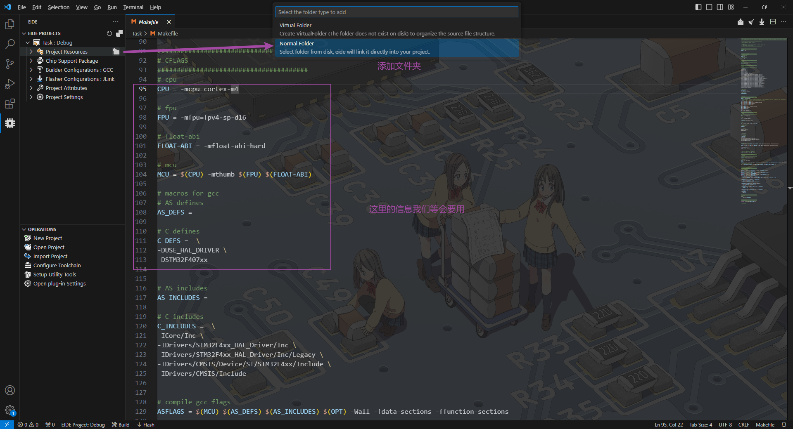

#### 项目配置

打开 `Makefile` 文件，并复制 `.Id` 文件的文件名称。

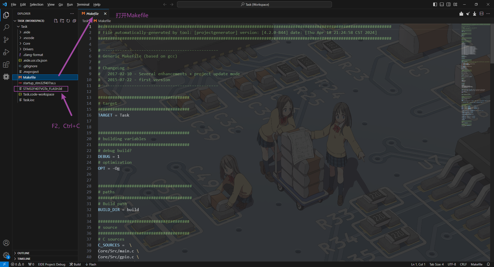

按照 `Makefile` 中的信息配置编译器和烧录器选项，并添加 `C` 的宏定义。
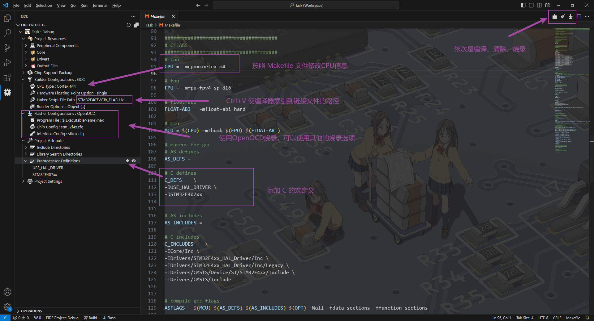

#### 编译

- 中文路径会导致编译失败。

编译成功后会显示内存资源占用、hex 和 bin 文件输出路径。

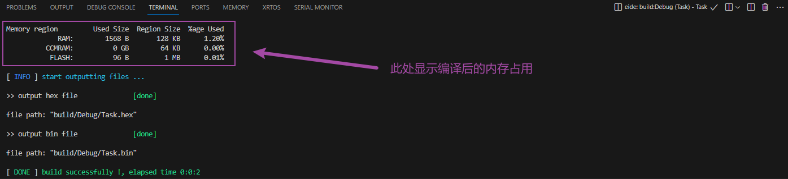

#### 调试

经过[版本更迭](https://marketplace.visualstudio.com/items/CL.eide/changelog)，`3.16.0` 删除了自动生成 `launch.json` 调试配置的功能，取而代之的是菜单栏中的 `Generate Cortex-Debug Configuration`。

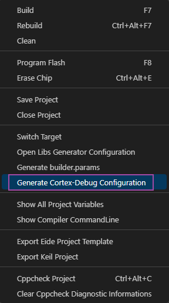
